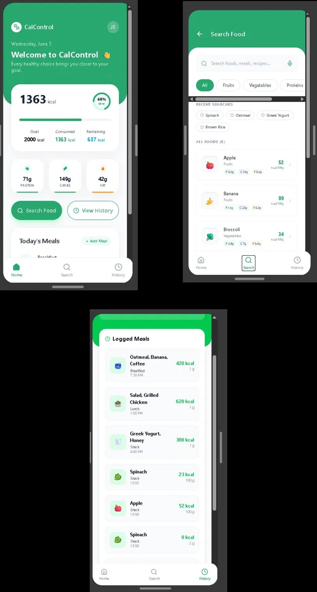

<div align="center">

# 🥗 CalControl

### Tu aliado inteligente para el control nutricional diario

[](https://developer.android.com)
[](https://kotlinlang.org)
[](https://developer.android.com/jetpack/compose)
[](https://m3.material.io)
[](https://github.com/AlexisMorales024/Cal-Control)

*Registra lo que comes. Conoce lo que consumes. Transforma tus hábitos.*

</div>

---

## 📋 Tabla de Contenidos

- [Descripción del Problema](#-descripción-del-problema)
- [Objetivo de la Aplicación](#-objetivo-de-la-aplicación)
- [Características Principales](#-características-principales)
- [Historias de Usuario del MVP](#-historias-de-usuario-del-mvp)
- [Tecnologías Utilizadas](#-tecnologías-utilizadas)
- [Arquitectura del Proyecto](#-arquitectura-del-proyecto)
- [Requisitos Previos](#-requisitos-previos)
- [Instrucciones de Instalación](#-instrucciones-de-instalación)
- [Capturas de Pantalla](#-capturas-de-pantalla)
- [Estado Actual del Proyecto](#-estado-actual-del-proyecto)
- [Autor](#-autor)

---

## 🚨 Descripción del Problema

Muchas personas desean llevar un control de su alimentación diaria y conocer con precisión su consumo calórico, pero se enfrentan a obstáculos que dificultan este propósito:

- **Complejidad de las apps existentes:** la mayoría de aplicaciones de nutrición presentan interfaces sobrecargadas, configuraciones avanzadas y curvas de aprendizaje altas que desaniman al usuario común.
- **Cálculo manual tedioso:** registrar calorías y macronutrientes a mano es un proceso propenso a errores y poco sostenible en el tiempo.
- **Falta de organización:** sin una herramienta adecuada, es difícil estructurar el registro de comidas por momentos del día (desayuno, almuerzo, cena, snacks).
- **Escasa retroalimentación:** los usuarios no cuentan con un resumen claro y visual de su progreso nutricional diario.

**CalControl** nació para resolver exactamente estos problemas: ofrecer una solución sencilla, intuitiva y eficiente para registrar alimentos y obtener información nutricional de manera rápida y organizada.

---

## 🎯 Objetivo de la Aplicación

Desarrollar una aplicación móvil Android que permita a los usuarios:

- **Registrar** los alimentos consumidos diariamente de forma rápida e intuitiva.
- **Calcular automáticamente** las calorías y macronutrientes (proteínas, carbohidratos y grasas) de cada alimento registrado.
- **Visualizar estadísticas básicas** sobre el consumo calórico del día.
- **Mejorar los hábitos nutricionales** a través del seguimiento continuo y organizado de la alimentación.

---

## ✨ Características Principales

- 🔍 **Búsqueda de alimentos** — Encuentra alimentos por nombre con información nutricional detallada por cada 100g.
- ➕ **Registro de comidas** — Agrega alimentos a distintas categorías del día: desayuno, almuerzo, cena o snack.
- 📊 **Resumen calórico diario** — Visualiza en tiempo real las calorías consumidas vs. tu meta personal.
- 🥩 **Seguimiento de macronutrientes** — Controla tu ingesta de proteínas, carbohidratos y grasas.
- 📅 **Historial de comidas** — Consulta el registro completo de todos los alimentos consumidos durante el día.
- 🏷️ **Categorías de alimentos** — Filtra entre frutas, verduras, proteínas y más para encontrar lo que buscas.
- 📈 **Estadísticas de consumo** — Monitorea tus hábitos alimenticios con métricas claras y comprensibles.
- 🎯 **Meta calórica personalizada** — Establece tu objetivo diario de calorías y lleva el control de tu progreso.

---

## 📖 Historias de Usuario del MVP

Las siguientes historias de usuario definen el alcance mínimo viable (MVP) de CalControl:

| ID | Historia de Usuario | Criterio de Éxito |
|----|--------------------|--------------------|
| **HU-01** | Como usuario, quiero **registrar los alimentos que consumo** durante el día para llevar un control de mi alimentación. | El usuario puede buscar y agregar alimentos a su diario del día actual. |
| **HU-02** | Como usuario, quiero que la aplicación **calcule automáticamente las calorías** de los alimentos registrados para conocer mi consumo diario. | Al registrar un alimento, se suman automáticamente sus calorías al total diario. |
| **HU-03** | Como usuario, quiero **visualizar un resumen de las calorías consumidas** durante el día para evaluar mi progreso nutricional. | La pantalla principal muestra calorías consumidas, restantes y el porcentaje de la meta alcanzada. |
| **HU-04** | Como usuario, quiero **consultar estadísticas básicas de consumo** para monitorear mis hábitos alimenticios. | El usuario puede acceder a un historial con el detalle de cada comida registrada en el día. |

---

## 🛠️ Tecnologías Utilizadas

### Plataforma y Lenguaje

| Tecnología | Versión | Descripción |
|------------|---------|-------------|
| **Android** | API 24+ | Plataforma de desarrollo móvil |
| **Kotlin** | 2.x | Lenguaje de programación principal |
| **Android Studio** | Ladybug+ | IDE oficial para desarrollo Android |

### Frameworks y Librerías UI

| Tecnología | Descripción |
|------------|-------------|
| **Jetpack Compose** | Framework moderno de UI declarativa para Android |
| **Material Design 3** | Sistema de diseño visual de Google (paleta verde, bordes redondeados) |

### Herramientas y Control de Versiones

| Herramienta | Descripción |
|-------------|-------------|
| **Git** | Control de versiones distribuido |
| **GitHub** | Repositorio remoto y colaboración |

---

## 🏗️ Arquitectura del Proyecto

CalControl sigue una arquitectura limpia y modular basada en los principios de separación de responsabilidades:

```
CalControl/
├── app/
│   ├── src/
│   │   ├── main/
│   │   │   ├── java/com/calcontrol/
│   │   │   │   ├── ui/
│   │   │   │   │   ├── screens/          # Pantallas principales (Home, Search, History)
│   │   │   │   │   ├── components/       # Componentes reutilizables de Compose
│   │   │   │   │   └── theme/            # Tema, colores y tipografía (Material 3)
│   │   │   │   ├── data/
│   │   │   │   │   ├── model/            # Modelos de datos (Food, Meal, DailyLog)
│   │   │   │   │   ├── repository/       # Repositorios de datos
│   │   │   │   │   └── local/            # Base de datos local (Room)
│   │   │   │   ├── domain/
│   │   │   │   │   └── usecase/          # Casos de uso (calcular calorías, registrar comida)
│   │   │   │   └── viewmodel/            # ViewModels por pantalla
│   │   │   └── res/
│   │   │       ├── drawable/             # Recursos gráficos e íconos
│   │   │       └── values/               # Strings, colores y dimensiones
│   │   └── test/                         # Pruebas unitarias
│   └── build.gradle.kts
├── .github/                              # Configuración de CI/CD (opcional)
├── README.md
└── build.gradle.kts
```

### Patrón de diseño

La aplicación sigue el patrón **MVVM (Model-View-ViewModel)** con los principios de **Clean Architecture**, separando claramente las capas de presentación, dominio y datos.

---

## ✅ Requisitos Previos

Antes de clonar y ejecutar el proyecto, asegúrate de tener instalado lo siguiente:

- **Android Studio** Ladybug (2024.2.1) o superior → [Descargar aquí](https://developer.android.com/studio)
- **JDK 17** o superior
- **Git** → [Descargar aquí](https://git-scm.com)
- Un dispositivo Android físico o un emulador con **API 24 (Android 7.0)** o superior
- Conexión a internet para la sincronización de dependencias con Gradle

---

## 🚀 Instrucciones de Instalación

Sigue estos pasos para clonar y ejecutar el proyecto en tu máquina local:

### 1. Clonar el repositorio

```bash
git clone https://github.com/AlexisMorales024/Cal-Control.git
```

### 2. Abrir el proyecto en Android Studio

```
Archivo → Abrir → Seleccionar la carpeta Cal-Control
```

O también puedes arrastrar la carpeta directamente a Android Studio.

### 3. Sincronizar dependencias

Android Studio sincronizará automáticamente las dependencias de Gradle al abrir el proyecto. Si no lo hace, ejecuta:

```
Build → Sync Project with Gradle Files
```

### 4. Configurar el dispositivo de ejecución

- **Emulador:** Ve a `Device Manager` y crea un AVD con API 24 o superior.
- **Dispositivo físico:** Habilita las opciones de desarrollador y la depuración USB en tu Android.

### 5. Ejecutar la aplicación

Presiona el botón ▶️ **Run** en Android Studio, o ejecuta desde la terminal:

```bash
./gradlew installDebug
```

---

## 📸 Capturas de Pantalla

## Prototipo de Figma



---

### Aplicación en Funcionamiento

> 🔜 *Capturas de la aplicación final se agregarán una vez completado el desarrollo.*

<!--
| Home | Search | History |
|---|---|---|
|  |  |  |
-->

---

## 📌 Estado Actual del Proyecto

```
🟢 En desarrollo activo — MVP en progreso
```

| Funcionalidad | Estado |
|---------------|--------|
| Pantalla principal con resumen calórico | ✅ Completada |
| Búsqueda de alimentos con filtros | ✅ Completada |
| Registro de comidas por categoría | ✅ Completada |
| Historial de comidas del día | ✅ Completada |
| Cálculo automático de macronutrientes | ✅ Completada |
| Base de datos local con Room | 🔄 En progreso |
| Estadísticas avanzadas | 🔜 Planificada |
| Configuración de metas personalizadas | 🔜 Planificada |

---

## 👨‍💻 Autor

<div align="center">

**Alexis Morales**

[](https://github.com/AlexisMorales024)

*Desarrollador Android — Proyecto CalControl*
## 🚀 Funcionalidades implementadas

- 🔐 Login de usuarios con validación de correo y contraseña  
- 📝 Registro de usuarios con almacenamiento en base de datos local (Room)  
- ✔ Validaciones en formularios (campos vacíos, formato de correo y contraseña mínima)  
- 🔄 Navegación entre pantallas (Login → Registro → Home)  
- 💾 Persistencia de usuarios en base de datos local  
- 🎨 Interfaz con Material Design y paleta de colores personalizada  
</div>

---

<div align="center">

**CalControl** · Hecho con 💚 para mejorar tus hábitos nutricionales

</div>
